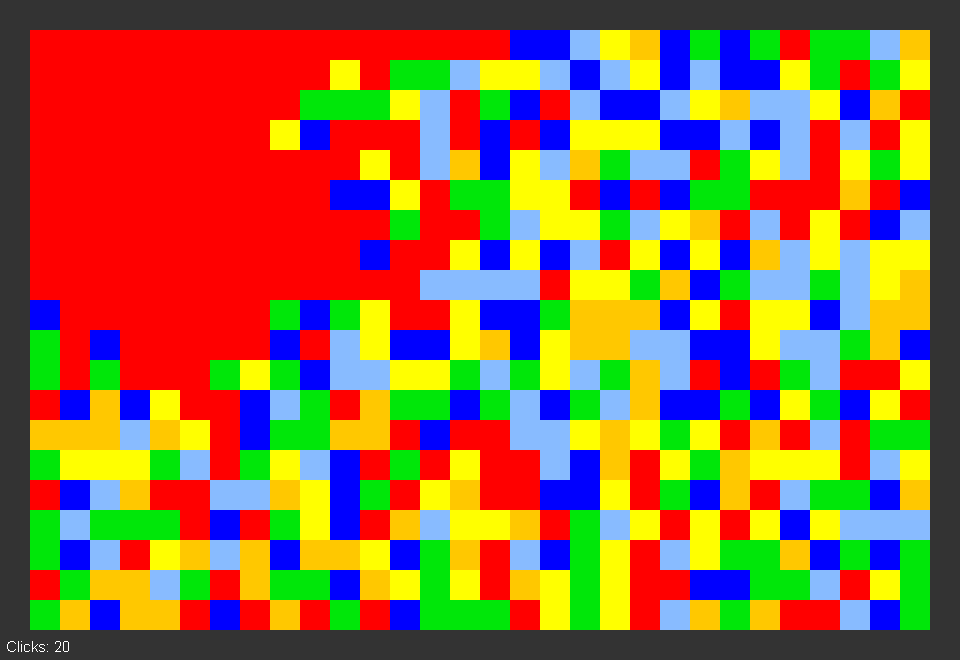

# Flood

A simple color based game. Fill the grid with a single color in as few clicks as possible.



Click any square to flood that square's color from the top left, covering all connected squares of the same color.

Can you flood the grid in fewer than 40 clicks?

## Build

To create an executable JAR file, simply run

```sh
$ ant
```

from the project root.
